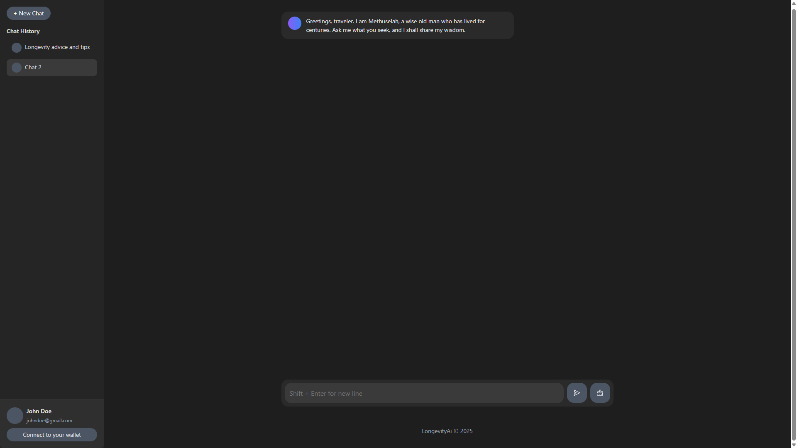

# Methuselah



Methuselah is an early-stage web application aimed at advancing research and innovation in longevity and healthspan. Built with **Next.js**, this project is in active development, and the current version represents a work in progress. We welcome contributions and feedback as we shape the future of Methuselah.

---

## 📑 Table of Contents

- [Project Overview](#project-overview)
- [Technologies](#technologies)
- [Getting Started](#getting-started)
  - [Prerequisites](#prerequisites)
  - [Installation](#installation)
  - [Running Locally](#running-locally)
- [Contributing](#contributing)
- [License](#license)
- [Contact](#contact)

---

## 🧬 Project Overview

Methuselah is a platform designed to explore and promote longevity-related solutions. While still in its infancy, the project leverages modern web technologies to deliver a scalable and user-friendly experience. This repository contains the frontend application, with plans for expanded features and integrations in future iterations.

> **Note:** The current version is a development prototype and does not reflect the final product.

---

## 🛠 Technologies

- **Framework:** Next.js 13.5.6
- **Runtime:** Node.js 20
- **Package Manager:** npm

---

## 🚀 Getting Started

### Prerequisites

To run Methuselah locally, ensure you have the following installed:

- [Node.js (v20 or higher)](https://nodejs.org/)
- npm (included with Node.js)
- Git for cloning the repository
- A code editor (e.g., [Visual Studio Code](https://code.visualstudio.com/))

### Installation

```bash
# Clone the repository
git clone https://github.com/PPSwap/Methuselah.git
cd Methuselah

# Install dependencies
npm install
```

---

### Environment Variables

1. **Obtain the `.env.example` file**:  
   Contact the project maintainers or refer to the project's Discord server.

2. **Place the `.env.example` file in the root directory** of the project.

3. **Rename it** to `.env.local`:

```bash
mv .env.example .env.local
```

4. **Edit `.env.local`** to include any required environment variables (e.g., API keys or endpoints) as specified in the documentation or Discord.

---

### Running Locally

Start the development server:

```bash
npm run dev
```

Then open your browser and go to:  
[http://localhost:3000](http://localhost:3000)

The application will automatically reload as you make changes to the source code.

---

## Contributing

We are excited to build Methuselah with the community! To contribute:

1. Fork the repository
2. Create a feature branch:

```bash
git checkout -b feature/YourFeature
```

3. Commit your changes:

```bash
git commit -m 'Add YourFeature'
```

4. Push to the branch:

```bash
git push origin feature/YourFeature
```

5. Open a Pull Request

> Please review the **Contributing Guidelines** (to be added) and adhere to the **Code of Conduct** (to be added).  
> For questions, join our Discord server or open an issue.

---

## License

This project is licensed under the **MIT License**.

---

## Contact

For inquiries, feedback, or to access the `.env.example` file, please:

- [Join our Discord server](https://discord.gg/Wdh53pcw)
- Open an issue on the GitHub repository
- Email: [hj7083@wayne.edu](mailto:hj7083@wayne.edu)

---

**Together, let’s shape the future of longevity with Methuselah.**
